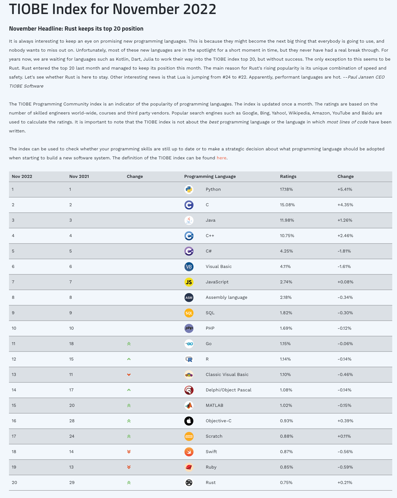

# 《The Rust Way of Programming》 Preface

This book is dedicated to Rust lovers around the world.

## Target Readers

Nowadays, many Rust programming learning materials are written for people with some programming basics. This book is an attempt and a challenge to be geared towards zero programming basics without losing the depth of the content, and to inspire developers with some Rust programming experience.

Since C can be geared towards beginners with zero programming fundamentals, so can Rust. But it's a challenge, because learning Rust requires a lot of basic computer and programming-related knowledge.

Fortunately, Time in progress.

The November 2022 TIOBE list finds the `Scratch` language at `#17`, higher than Rust, which is at `#20`. `Scratch` is a language for kids, and this ranking indicates a worldwide trend of children and teens learning to program. `Python`, the top-ranked language, has also sunk to the list for teens learning programming.

Traditionally, people who can't program are broadly classified as those who have zero programming skills. But we are now in an era where programming has become popular among teenagers, and it is time to redefine the zero-based programming population.

Redefine the broad zero-basic programming population as.
1. people who are interested in computers and programming and already have an initial understanding of computers and programming. This level of understanding, at least, is to know what programming is? What can programming do? What can computers do? 
2. we exclude the "one-finger" people who can't even type on a computer keyboard, not because of discrimination, but because the target group of this book will never be these people, because they may not even be interested in computers.

Defining the target readers facilitates the organization of the book.

Since the book is mainly about the Rust language, we need to further define the zero programming base for this book according to the characteristics of the Rust language: 
1. People who have some basic knowledge of the `C` language. The foundation of learning `Rust` is `C`. Because the `C` language has long replaced assembly language solidified as the interface between hardware and software. As to what level of `C` language is considered basic, we will provide the `C` language foundation in the appendix .
2. People who have some knowledge of operating systems. After all, Rust is a system-level programming language, and knowledge of the operating system is the foundation for mastering Rust. In fact, in addition to operating system knowledge, it also includes computer composition principles, etc. These are the basics that Rust language learners need to have. But we can't ask too much for zero programming knowledge, at least experience with Linux, or an understanding of the difference between the Linux kernel and user state.

Although this book is aimed at people with zero programming knowledge, you can't have no basic knowledge either.

Therefore, the appropriate audience for this book is
- Those who meet the above definition of programming
- People who want to learn Rust systematically and want to master the language in depth

## Content Organization

TODO
